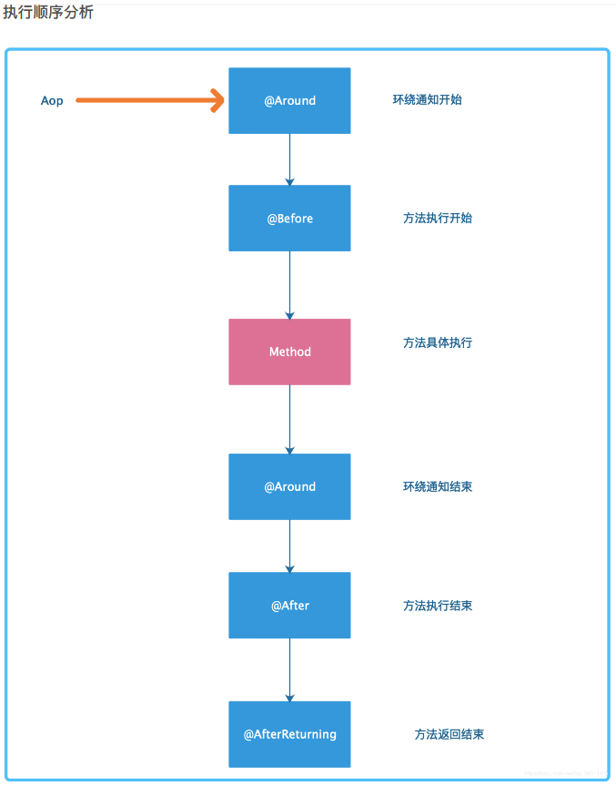
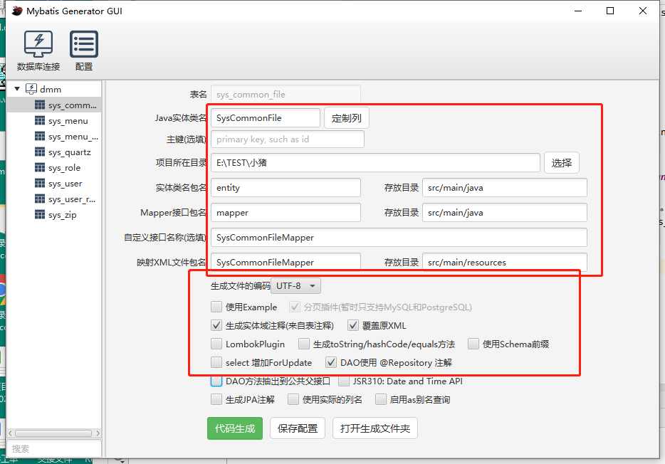
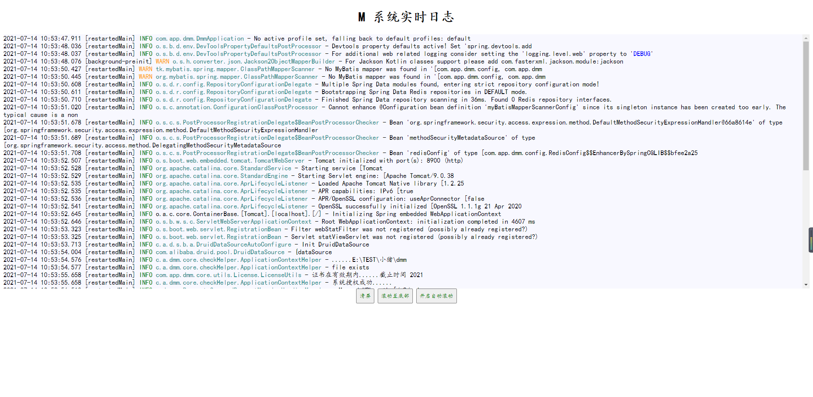
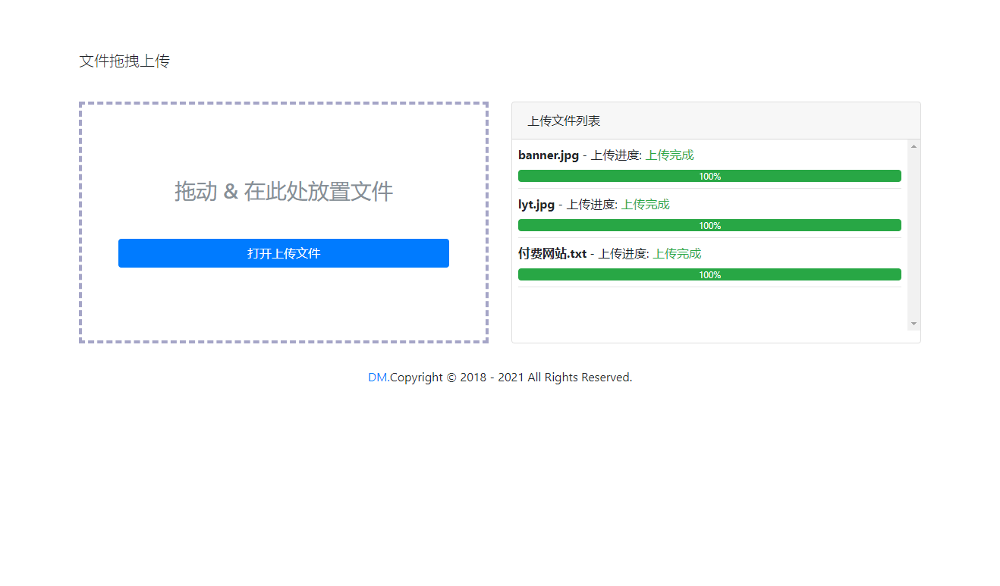

# 小萌主单体 springBoot实践应用
### 系统描述
#### 通过系统实践设计一套RBAC权限管理系统 ，业务功能可以集成答题系统、贺卡系统
##
### 系统技术栈
* 前端 vue
* 后端 SpringBoot 2.3.4 + Swagger  + MyBaits集成通用mapper  +    druid

* 用户认证方案  SpringSecurity5 + JWT + redis
##
### 开发工具说明
* 安装 IDEA  [安装教程](https://www.jb51.net/article/186186.htm)

* 安装 免安装版 mysql  [官网下载地址](https://dev.mysql.com/downloads/mysql/)    [教程](https://www.cnblogs.com/winton-nfs/p/11524007.html)

* 安装 redis [教程](https://www.redis.net.cn/tutorial/3503.html)
  
* 安装 postman [官网](https://www.postman.com/downloads/)

* 安装 node.js [官网](https://nodejs.org/en/)   [教程](https://blog.csdn.net/muzidigbig/article/details/80493880)
##

### SpringSecurity5

安全框架描述

##

### AOP 面向切面
面向切面说明

##

### [mybatis-generator-gui 代码生成器](https://github.com/zouzg/mybatis-generator-gui)

官方网址：https://github.com/zouzg/mybatis-generator-gui

* **打包方式执行**

     git clone https://github.com/zouzg/mybatis-generator-gui

     cd mybatis-generator-gui

     mvn jfx:jar

     cd target/jfx/app/

     java -jar mybatis-generator-gui.jar

* **windows系统下 exe直接运行**

     直接执行项目 /exe路径下的 mybatis-generator-gui.exe 文件
     
* **操作说明**

##

### 业务开发说明

* 在 src/main/java/com/app/dmm/modules在新增业务模块方便后期维护
* druid连接池查看地址 	http://localhost:8900/druid/sql.html
* swagger接口文档地址 	http://localhost:8900/swagger-ui.html

* 项目访问步骤

**第一步、执行获取验证码 http://localhost:8900/randomImage/222222215** (另见swagger接口文档内容)

**第二步、登录系统** 

**第三步、返回的结果result参数为token，之后每次的请求要求携带token访问，否则token为空请求被拦截**

正常请求关注点：

## 

### 软件授权管理

* ApplicationContextHelper.java 软件安装首次自动授权安装激活码，拿到激活码之后所有访问添加验证即可
* 激活码设计原则  LicenseUtils.java  ,采用混合加密AES RSA 加密算法
* SpringBoot定时器+文件Md5码实现文件变动检测 
* 参考文章

  https://blog.csdn.net/Appleyk/article/details/102880949 
  
  https://github.com/kobeyk/file-changing
##

###  webSocket系统日志实时查看

* logback-spring.xml 配置日志按日期时间保存
* 系统启动访问地址   http://localhost:8900/logging.html  

##
###  压缩包加密玩法 （ https://github.com/srikanth-lingala/zip4j ）

* 用于网络资源分享，把资源生成加密压缩包分享给享用者。密钥随机生成放到 redis 缓存中

* 从系统文件（sys_common_file）读取文件路径， (sys_zip)压缩文件对应密钥
##

###  **文件拖拽上传**  http://www.i7758.com/archives/1068.html

*  项目访问地址: http://localhost:8900/file_upload/fileUpload.html

##

###
* 联系作者微信扫码

