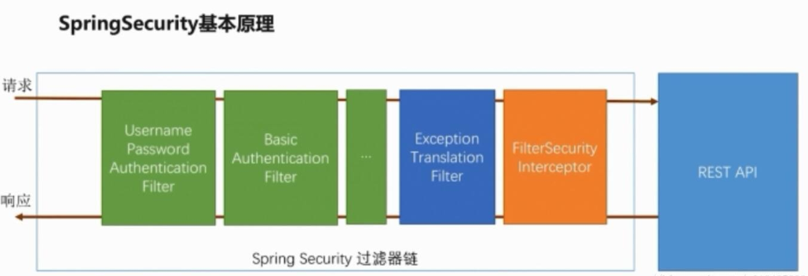
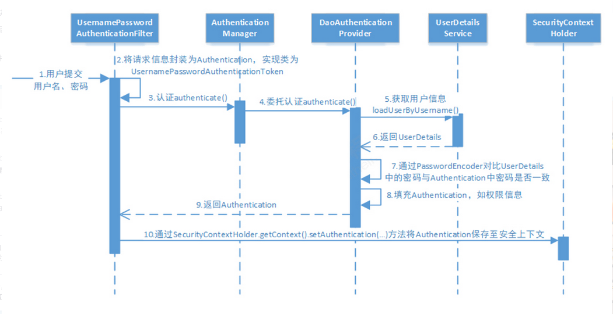
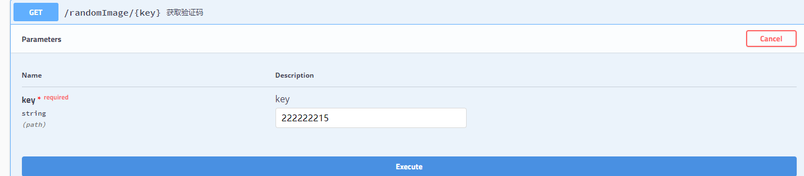
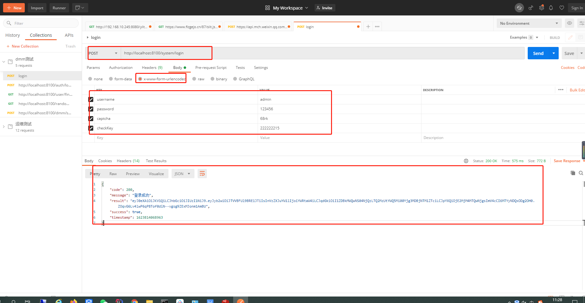
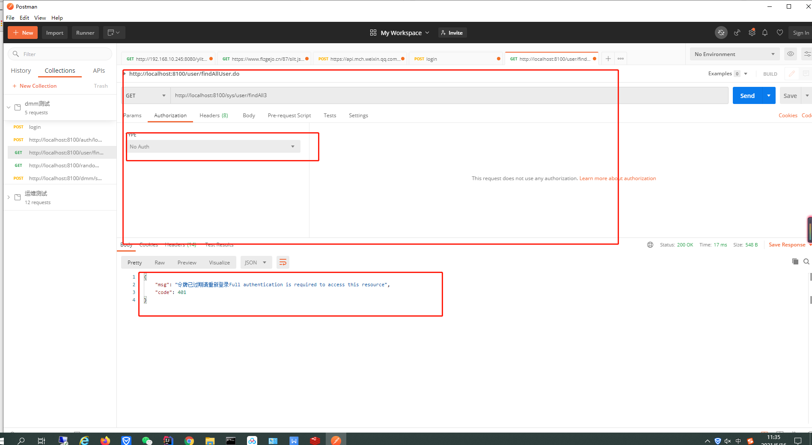
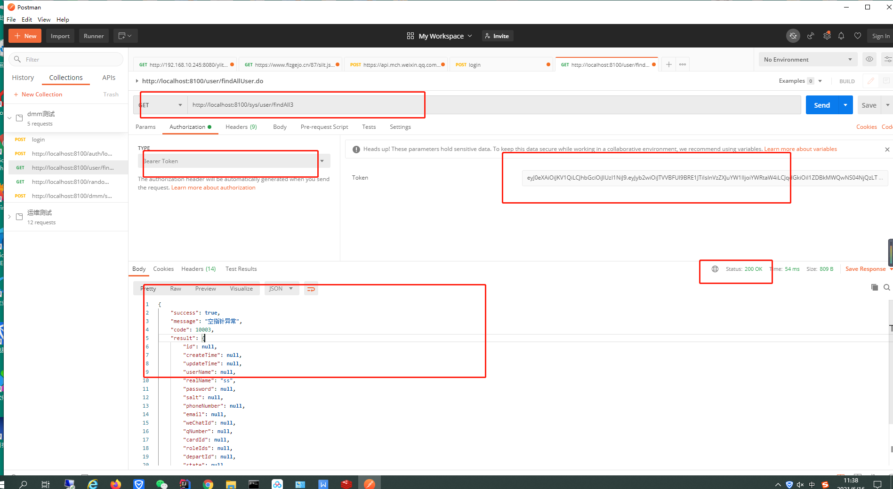

# 小萌主单体 springBoot实践应用
### 系统描述
#### 通过系统实践设计一套RBAC权限管理系统 ，业务功能可以集成答题系统、贺卡系统
##
### 系统技术栈
* 前端 vue
* 后端 SpringBoot 2.3.4 + Swagger  + MyBaits集成通用mapper  +    druid

* 用户认证方案  SpringSecurity5 + JWT + redis
##
### 开发工具说明
* 安装 IDEA  [安装教程](https://www.jb51.net/article/186186.htm)

* 安装 免安装版 mysql  [官网下载地址](https://dev.mysql.com/downloads/mysql/)    [教程](https://www.cnblogs.com/winton-nfs/p/11524007.html)

* 安装 redis [教程](https://www.redis.net.cn/tutorial/3503.html)
  
* 安装 postman [官网](https://www.postman.com/downloads/)

* 安装 node.js [官网](https://nodejs.org/en/)   [教程](https://blog.csdn.net/muzidigbig/article/details/80493880)
##

### SpringSecurity5

安全框架描述





* spring security 说明

  本篇采用jwt自定义token,security安全框架默认会把所有项目资源保护起来。开发过程可以放行所有资源
  
  需要在 WebSecurityConfig.java 替换 protected void configure(HttpSecurity http) throws Exception { ... 方法
  
  替换如下：<font size=1 font color=#DC143C font face="黑体">( 开发环境 )</font> 
```
/**
   * 自定义配置放行所有
   */
  @Override
  protected void configure(HttpSecurity http) throws Exception {
      http.authorizeRequests().antMatchers("/**").permitAll()// 所有请求都可以访问
              .and().csrf().disable() // 跨域請求关闭
              .headers().frameOptions().disable(); // 资源下载权限关闭
  }
```
 <font size=1 font color=#DC143C font face="黑体">（ 实际环境 ）</font>
```
@Override
    protected void configure(HttpSecurity http) throws Exception {
        //开启登录配置
        //http.addFilterBefore(new VerifyCodeFilter(), UsernamePasswordAuthenticationFilter.class);
        // 禁用 csrf, 由于使用的是JWT，我们这里不需要csrf
        //允许跨域访问
        http.cors();

        //放行swagger
        http.authorizeRequests()
                .antMatchers("/v2/api-docs",//swagger api json
                        "/swagger-resources/configuration/ui",//用来获取支持的动作
                        "/swagger-resources",//用来获取api-docs的URI
                        "/swagger-resources/configuration/security",//安全选项
                        "/swagger-ui.html",
                        "/webjars/**").permitAll();
        //关闭csrf
        http.csrf().disable()
                .sessionManagement()// 基于token，所以不需要session
                .sessionCreationPolicy(SessionCreationPolicy.STATELESS)
                //未登陆时返回 JSON 格式的数据给前端
                //.and()
                //.httpBasic().authenticationEntryPoint(authenticationEntryPointImp)
                .and()
                .authorizeRequests()
                //任何人都能访问这个请求
                .antMatchers("/auth/**").permitAll()
                .antMatchers("/system/**").permitAll()
                // 查看sql监控(druid)
                .antMatchers("/druid/**").permitAll()
                // 验证码
                .antMatchers("/captcha.jpg**").permitAll()
                .antMatchers("/randomImage/**").permitAll()
                .antMatchers("/websocket/logging").permitAll()
                .antMatchers("/createQRcode").permitAll()
                .antMatchers("/sys/file/*").permitAll()
                //.antMatchers("/sys/user/*").permitAll()
                //除上面配置的路径外，所有的请求都需要进行认证后才能访问
                .anyRequest().authenticated()
                .and()
                .formLogin()
                // （登录页面或是提示用户未登录的页面 不设限访问）
                .loginPage("/index.html")
                //认证通过后的事件处理（在这里返回token）
                //拦截的请求
                .loginProcessingUrl("/system/login")
                // 登录成功
                .successHandler(authenticationSuccessHandler())
                // 登录失败
                .failureHandler(authenticationFailureHandler())
                .permitAll()
                .and()
                .addFilter(new JwtLoginAuthenticationFilter(authenticationManager()))
                .addFilter(new JwtAuthorizationFilter(authenticationManager()))
                //设置登录注销url，这个无需我们开发，springsecurity已帮我们做好
                .logout().logoutUrl("/user/logout").permitAll()
                .and()
                //配置 记住我 功能，
                .rememberMe().rememberMeParameter("rememberme");
//                 防止iframe 造成跨域
//                .and()
//                .headers()
//                .frameOptions()
//                .disable();
        http.httpBasic().disable();
        //.and().httpBasic(); //开启HTTP Basic后 ，可用postman通过携带用户名+密码直接请求接口
        // 禁用缓存
        //http.headers().cacheControl();
        // 资源下载权限关闭
        http.headers().frameOptions().disable();
        // 开启登录认证流程过滤器
        http.addFilterBefore(new JwtLoginAuthenticationFilter(authenticationManager()), UsernamePasswordAuthenticationFilter.class);
        // 访问控制时登录状态检查过滤器
        http.addFilterBefore(new JwtAuthorizationFilter(authenticationManager()), UsernamePasswordAuthenticationFilter.class);
        // 无权访问 JSON 格式的数据
        //http.exceptionHandling().accessDeniedHandler(accessDeniedHandler);
        http.exceptionHandling().accessDeniedHandler(new JwtAccessDeniedHandler());      //添加无权限时的处理
        //没有认证时，在这里处理结果，不要重定向
        //http.exceptionHandling().authenticationEntryPoint(authenticationEntryPointImp);
        http.exceptionHandling().authenticationEntryPoint(new JwtAuthenticationEntryPoint());
        // 退出登录处理器
        // http.logout().logoutSuccessHandler(new HttpStatusReturningLogoutSuccessHandler());

    }
```


  
##


### AOP 面向切面
面向切面说明


##

### [mybatis-generator-gui 代码生成器](https://github.com/zouzg/mybatis-generator-gui)

官方网址：https://github.com/zouzg/mybatis-generator-gui

* **打包方式执行**

     git clone https://github.com/zouzg/mybatis-generator-gui

     cd mybatis-generator-gui

     mvn jfx:jar

     cd target/jfx/app/

     java -jar mybatis-generator-gui.jar

* **windows系统下 exe直接运行**

     直接执行项目 /exe路径下的 mybatis-generator-gui.exe 文件
     
* **操作说明**


##

### 业务开发说明

* 根据不同的环境修改系统的配置

  1、修改application.yml 数据库连接端口等
  
  2、修改 config/config.properties 系统相关文件配置参数
  
  3、修改日志输出路径 logback-back.xml 

* 在 src/main/java/com/app/dmm/modules在新增业务模块方便后期维护
* druid连接池查看地址 	http://localhost:8900/druid/sql.html
* swagger接口文档地址 	http://localhost:8900/swagger-ui.html

* 项目访问步骤

**第一步、执行获取验证码 http://localhost:8900/randomImage/222222215** (另见swagger接口文档内容)



**第二步、登录系统** 



**第三步、返回的结果result参数为token，之后每次的请求要求携带token访问，否则token为空请求被拦截**



正常请求关注点：


## 

### 软件授权管理

* ApplicationContextHelper.java 软件安装首次自动授权安装激活码，拿到激活码之后所有访问添加验证即可
* 激活码设计原则  LicenseUtils.java  ,采用混合加密AES RSA 加密算法
* SpringBoot定时器+文件Md5码实现文件变动检测 
* 参考文章

  https://blog.csdn.net/Appleyk/article/details/102880949 
  
  https://github.com/kobeyk/file-changing
##

###  webSocket系统日志实时查看

* logback-spring.xml 配置日志按日期时间保存
* 系统启动访问地址   http://localhost:8900/logging.html  

##
###  压缩包加密玩法 （ https://github.com/srikanth-lingala/zip4j ）

* 用于网络资源分享，把资源生成加密压缩包分享给享用者。密钥随机生成放到 redis 缓存中

* 从系统文件（sys_common_file）读取文件路径， (sys_zip)压缩文件对应密钥
##

###  **文件拖拽上传**  http://www.i7758.com/archives/1068.html

*  项目访问地址: http://localhost:8900/file_upload/fileUpload.html


##
###
* 联系作者微信扫码


